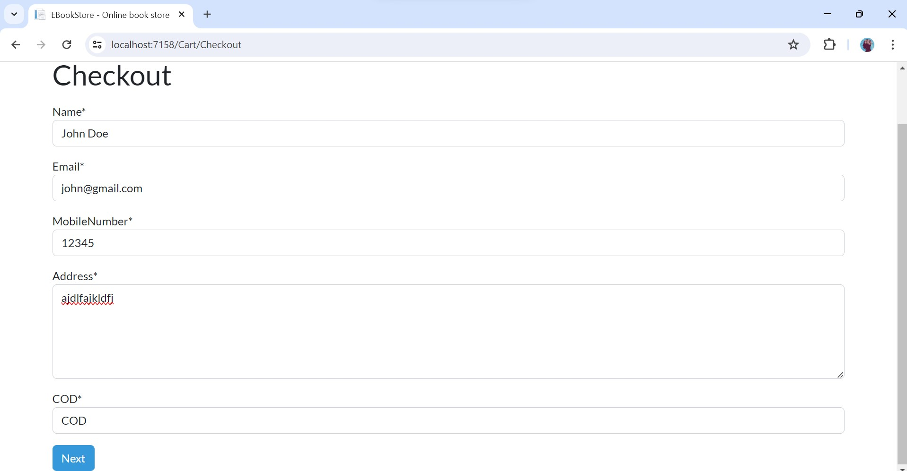

# 書店電商系統練習MVC

## 技術使用

   - .Net core mvc (.Net 9)
   - MS SQLServer 2022 
   - Entity Framework Core 
   - Identity Core (驗證)
   - Bootstrap 5 

## 截圖

1.首頁

2.首頁

3.登錄

4.註冊

5.加入購物車

6.購物車

7.結帳

8.購買成功

9.管理員登錄

10.管理員面板

