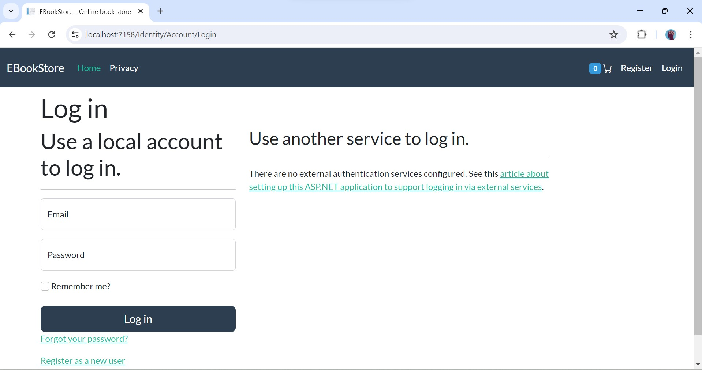
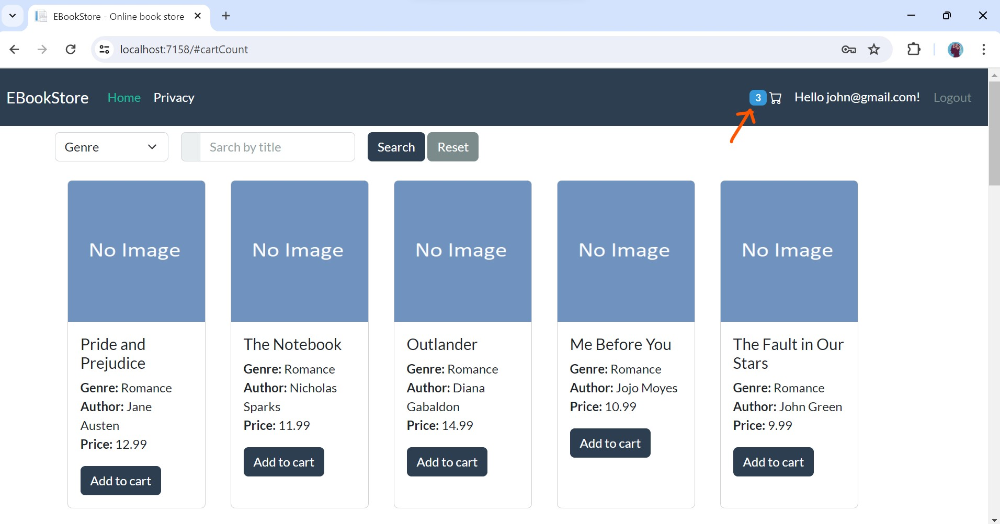

# BookShoppingCartMvc

## Tech stack 🧑‍💻
   - Dotnet core mvc (.Net 9)
   - MS SQLServer 2022 (Database)
   - Entity Framework Core (ORM)
   - Identity Core (Authentication)
   - Bootstrap 5 (frontend)

## Screenshots

1.Homepage

2.Homepage continued

3.Login

4.Registration

5.Add To Cart

6.Cart

7.Checkout

8.Order success

9.Admin Login

10.Admin Dashboard

